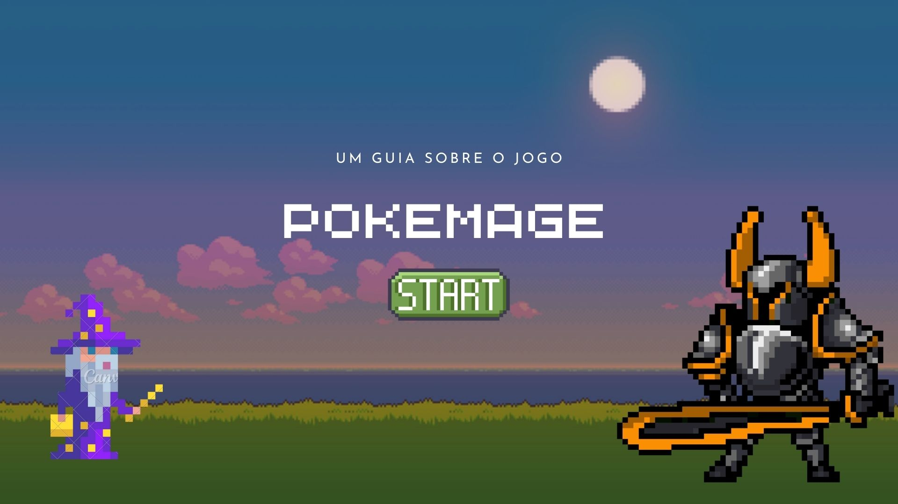

<h1 align="center"> PokeMage </h1>

<h1 align="center"> Jogo de RPG desenvolvido na pseudolinguagem Portugol através da ferramenta Portugol Studio - Estágio em Desenvolvimento Web Sponte 2023 </h1>

 
 
 

## ❓ O que é ?

PokeMage é um jogo de RPG sobre magos, magias, estratégia, 

## 🖥️ Tecnologias 

Este projeto foi desenvolvido com as tecnologias: 

- Portugol 
- Git e GitHub 
